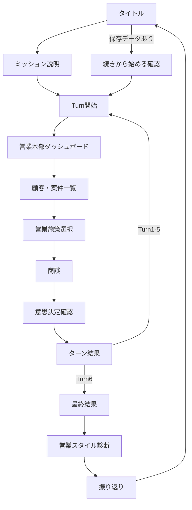

# SALES CRISIS ― 売上1億円からの脱出 ―
## 画面設計・UX・データ構造仕様書（STEP3）

- 文書ステータス: MVP実装前の画面・UX・データ構造仕様
- 対象バージョン: 初期版
- 対象シナリオ: BtoB法人営業・無形商材・高価格帯商材
- 本書の役割: 次工程でHTML/CSS/JavaScript実装に迷わないための表示、操作、状態管理の定義
- 関連仕様: `GAME_SPEC.md`、`GAME_LOGIC_SPEC.md`

> 本書はゲームロジックを再定義しない。数値計算、案件状態、施策効果、イベント条件、受注判定はゲームロジック確定仕様書に従い、画面ではプレイヤーが意思決定できる範囲に要約して表示する。

---

## 1. UX基本方針

### 1.1 設計目標

このゲームの中心体験は「操作」ではなく「限られた情報と資源をもとにした営業判断」である。画面は次の原則で設計する。

| 方針 | 設計内容 |
|---|---|
| 面白さ | ターンごとに状況が変化し、選択の結果が次ターンに現れる |
| 初心者対応 | 画面上の専門語を減らし、必要な意味を短い補助文で示す |
| 情報量の制御 | 全顧客を毎回確認させず、重要顧客と変化した顧客を先に表示する |
| 議論の誘発 | 施策選択前に優先方針と捨てる対象をチームで確認する |
| トレードオフ | 売上、粗利、満足度、将来案件、営業力を同時に最大化できない設計を見せる |
| 因果の理解 | 結果画面で「選択」「起きたこと」「KPIへの影響」を対応づける |
| 講師の利用 | 結果と意思決定ログを短時間で確認できる |
| 低い操作負荷 | 1ターンの主な決定を施策3〜5件、商談1〜2件に制限する |

### 1.2 表示と内部値の分離

- 内部データでは受注確度を0〜100の数値で保持する。
- 通常画面では受注確度を次の5段階で表示し、正確な数値を隠す。
  - 非常に低い: 0〜19
  - 低い: 20〜39
  - 中: 40〜59
  - 高い: 60〜79
  - 非常に高い: 80〜100
- プレイヤーが取得した情報、準備、ヒアリング、関係性によって表示の説明を増やす。
- 正確な受注確度、判定式、乱数値は通常プレイ中に表示しない。
- 結果画面では、確度が上がった・下がった理由を自然言語で説明する。
- 講師モードでは、内部値と計算要素を確認できる。

### 1.3 画面共通ルール

- 画面上部に現在のTurn、残り期間、現在売上、目標までの残額を固定表示する。
- 1画面1主目的とし、主要ボタンは1つにする。
- 戻る操作は可能だが、ターン確定後の巻き戻しはできない。
- 施策、商談、イベントの選択では、確定前に使用RP・予算・対象を必ず表示する。
- 選択不能な項目は非表示にせず、理由を表示して学習機会にする。
- ツールチップは専門語に限定する。説明文を常時大量に表示しない。
- 色だけで状態を表現せず、ラベル、アイコン、文章を併用する。

### 1.4 画面で使う呼称

| 内部名称 | 画面表示 | 補助説明 |
|---|---|---|
| RP | 営業力 | このターンに使える活動時間と対応力 |
| pipeline | 案件パイプライン | これから受注を目指す案件の額面合計 |
| probability | 受注見込み | 現時点の情報から見た受注の見込み |
| gross profit | 粗利 | 売上から提供コストを引いた利益 |
| opportunity | 案件 | 顧客に対して進行中の受注機会 |
| action | 営業施策 | リード形成や顧客対応に使う活動 |

---

## 2. 全体画面遷移

### 2.1 画面一覧

| ID | 画面名 | 表示タイミング | 次の画面 |
|---|---|---|---|
| S01 | タイトル | 起動時 | ミッション説明 |
| S02 | ミッション説明 | 新規ゲーム開始時 | Turn開始 |
| S03 | Turn開始 | 各Turnの開始時 | 営業本部ダッシュボード |
| S04 | 営業本部ダッシュボード | 各Turnの状況確認 | 顧客・案件一覧 |
| S05 | 顧客・案件一覧 | 顧客または案件を確認するとき | 営業施策選択または商談 |
| S06 | 営業施策選択 | 施策を決めるとき | 商談または意思決定確認 |
| S07 | 商談 | 選択した案件を進めるとき | 商談または意思決定確認 |
| S08 | 意思決定確認 | Turnを確定する直前 | ターン結果 |
| S09 | ターン結果 | Turn確定後 | 次Turn開始または最終結果 |
| S10 | 最終結果 | Turn6終了後 | 営業スタイル診断 |
| S11 | 営業スタイル診断 | 最終結果確認後 | 振り返り |
| S12 | 振り返り | ゲーム終了時 | タイトルまたは結果保持 |
| S13 | 続きから始める確認 | 保存データがある起動時 | Turn開始 |
| S14 | 講師モード | 隠し入口または専用起動時 | 講師メニュー |

### 2.2 遷移図

### 2.3 画面遷移の制約

- S04からS05、S06へ進む際、すべての顧客を確認する必要はない。
- S06で施策を0件にすることは可能だが、S08で未使用営業力の影響を確認する。
- S07の商談は1Turnにつき原則最大2案件。3案件目以降は確認ダイアログを表示する。
- S08で確定した後は、施策、商談、理由を変更できない。
- イベントが発生した場合は、S03またはS04の冒頭にイベントカードを挿入し、対応選択を先に行う。

---

## 3. 1ターンのユーザーフロー

1Turnは約5分を目標とする。

| 時間目安 | フェーズ | プレイヤーが行うこと | 画面 |
|---:|---|---|---|
| 30秒 | 状況把握 | 前Turnの変化、重要アラート、残り期間を確認 | S03〜S04 |
| 60秒 | 優先順位 | 今Turnの重点方針を1つ選び、捨てる対象を確認 | S04 |
| 60秒 | 施策配分 | 施策を最大5件まで選ぶ。営業力と予算を配分 | S06 |
| 90秒 | 重要商談 | 最大2案件について質問、提案、価格、次回行動を決める | S07 |
| 20秒 | チーム確認 | 方針、優先顧客、使用資源、理由を確認 | S08 |
| 40秒 | 結果確認 | 成果、失注、保留、KPI変化、次Turnの注意点を確認 | S09 |

### 3.1 1Turnで制限するもの

- 重点方針: 1つ
- 重点顧客: 最大3社
- 営業施策: 最大5件。ただしRPと予算の範囲内
- 商談案件: 原則1件、最大2件
- 商談質問: 1案件につき最大3問
- 自由記述: 1Turnにつき最大140文字、任意
- 結果画面で確認する主要変化: 最大5件。詳細は展開式

### 3.2 「捨てる」判断の扱い

S04で重点方針を選択した後、次のいずれかを確認する。

- 今Turnは対応しない顧客
- 今Turnは後回しにする案件
- 今Turnは投資しない活動

プレイヤーに必須入力を求めず、選択結果から自動で「未対応」としてログに記録する。任意で理由を選択できる。

理由の選択肢:

- 受注までの期間が長い
- 受注見込みが低い
- 金額が小さい
- 今Turnは顧客維持を優先
- 今Turnは大型案件を優先
- 情報不足で判断できない

---

## 4. 各画面仕様

| 画面名 | 目的 | 表示情報 | 操作 | ボタン | 次画面 | 内部更新データ | 初心者向け補助 | ゲーム演出 |
|---|---|---|---|---|---|---|---|---|
| タイトル | ゲームを開始する | タイトル、短いミッション、所要時間、チーム人数 | 新規開始または保存データ選択 | ゲームを開始、続きから始める、遊び方 | S02またはS13 | 新規gameState作成時のみ | 目標とプレイ時間を1文で表示 | 控えめな売上メーターの初期表示 |
| ミッション説明 | 初期状態と目的を理解する | 現在売上35M、目標100M、残り65M、予算12M、営業力12/12、顧客数、初期案件8件、パイプライン97M | 重要情報を確認 | ミッションを開始 | S03 | ゲーム開始時刻 | 各KPIに1行説明、用語ツールチップ | 目標メーターを0から35Mまで表示 |
| Turn開始 | 今Turnの意味を理解する | Turn番号、残り期間、Turnの役割、重要KPI、前Turnの未解決事項 | 要点を確認 | 状況を確認する | S04 | turnState.startedAt | 重点は3項目以内 | Turnカード切替 |
| 営業本部ダッシュボード | 全体状況から方針を決める | 常時KPI、アラート、今Turnの推奨確認先、イベント | 重点方針を1つ選択、顧客一覧へ | 顧客を見る、施策を選ぶ | S05またはS06 | strategy、priorityCustomers | 方針ごとの短い利点・リスク | 売上メーター、残りTurn表示 |
| 顧客・案件一覧 | 対応対象を絞る | 顧客カード、案件カード、フィルター、変化マーク | カードを最大3件ピン留め、詳細を開く | 施策を選ぶ、商談する | S06またはS07 | viewedCustomers、priorityCustomers | 「変化あり」「要フォロー」を上部表示 | 重要度バッジの控えめな表示 |
| 営業施策選択 | 営業力と予算の配分を決める | 10施策、RP、予算、短期/中長期、対象、期待効果、リスク | 施策を追加・削除、対象指定 | 選択内容を確認 | S07またはS08 | selectedActions、resourceAllocation | 効果を売上だけでなく期間とリスクで表示 | 選択時に営業力メーターを更新 |
| 商談 | 顧客理解と提案を決める | 開示済み顧客情報、質問、主提案、副提案、価格、次回行動 | 最大3問、提案軸、値引き、行動を選択 | 商談を保存、次の案件 | S07またはS08 | meetings、revealedInfo、preparation | 未確認情報は「確認できていない」と表示 | 顧客反応は確定結果を隠した短文表示 |
| 意思決定確認 | チームの決定を確定する | 方針、優先顧客、施策、商談、営業力、予算、未対応項目 | 内容を確認、任意理由を入力 | 戻って修正、2か月を進める | S09 | rationale、confirmedAt | 確定後に戻れないことを明示 | 確定ボタン押下時に短い確認演出 |
| ターン結果 | 行動の結果と因果を理解する | 受注、失注、保留、案件化、顧客満足度、売上、粗利、予算、パイプライン | 詳細理由を展開、次Turnの注意点を見る | 次Turnへ、最終結果へ | S03またはS10 | kpis、outcomes、decisionLog | 「選択→結果→影響」の順で表示 | 大型受注、目標達成接近時のみ強調演出 |
| 最終結果 | 目標達成と評価を確認する | 脱出判定、最終売上、達成率、粗利率、満足度、生産性、将来案件、スコア、ランク | 指標詳細を開く | 営業スタイルを見る | S11 | finalResult | 合否だけでなく評価理由を表示 | 成功・失敗の明確な画面演出 |
| 営業スタイル診断 | 意思決定の傾向を理解する | 最大3タイプ、特徴、根拠KPI、改善ポイント | タイプ詳細を開く | 振り返りへ | S12 | styleDiagnosis | 良し悪しではなく傾向として説明 | タイプごとに色とアイコンを変更 |
| 振り返り | 研修議論の材料を提供する | 成功、改善、見逃し、事実、KPI影響、代替案、全ログ | 詳細ログを展開、講師用表示 | 最初から、タイトルへ | completed、reflectionViewed | 一覧は各3件以内、詳細は展開式 | 最後にチームの学びを任意入力 |

---

## 5. ダッシュボード仕様

### 5.1 常時表示するKPI

S03以降のヘッダーに次の6項目を表示する。

| 表示 | 例 | 表示ルール |
|---|---|---|
| 累計売上 | 3,500万円 | 初期確定売上を含む。万円単位で表示 |
| 目標まで | あと6,500万円 | 達成後は「目標達成」と表示 |
| 粗利率 | 32% | 色だけで評価せず、前Turn差を併記 |
| 残り予算 | 1,200万円 | 今Turnの使用前後を表示 |
| 営業力 | 12/12 | 今Turnに使えるRP。内部名はツールチップに表示可 |
| 顧客満足度 | 68 | 全体平均。前Turn差を併記 |

案件パイプラインはヘッダーに常時表示せず、ダッシュボードの主要カードとして表示する。これによりKPIの常時表示を増やしすぎない。

### 5.2 ダッシュボードの構成

1. ヘッダーKPI
2. Turnカード
3. 今Turnのイベントカード（発生時のみ）
4. 売上進捗バー
5. 重点方針セレクター
6. 要確認顧客3件
7. 案件パイプライン概要
8. 詳細画面へのリンク

### 5.3 アラート

アラートは最大3件に制限する。優先順位は次のとおり。

1. 今Turnに対応しないと失注または更新危機になる情報
2. 顧客満足度が低く、クレームまたは離反リスクがある情報
3. 期限が近く、対応効果が大きい案件

アラート文は「顧客Dは満足度が低く、放置すると更新リスクがあります」のように、事実と可能性を分けて表示する。確定していない未来を断定しない。

### 5.4 重点方針

各Turnで次の方針から1つを選択する。Turnごとに利用可能な選択肢を絞ってもよいが、初期版では全方針を表示する。

- 既存顧客を守る
- 大型案件を進める
- 新規案件を増やす
- 重要商談を深める
- 粗利を守る
- 情報を集める

方針選択はボーナスを直接与えるものではなく、チームの議論とログのために保存する。効果は選択した施策と商談判断から生じる。

---

## 6. 顧客・案件カード仕様

### 6.1 一覧カードに表示する項目

| 項目 | 表示方針 |
|---|---|
| 会社名・顧客ID | 常時表示 |
| 顧客属性 | 規模と特性を短く表示。例: 大企業・品質重視 |
| 案件金額 | 額面を表示。受注後は実売上と区別 |
| 案件ステージ | 未接触、リード、有望案件、商談中、提案済みなど |
| 受注見込み | 「低い」「中」「高い」などの帯表示。内部確度は非表示 |
| 顧客満足度 | 0〜100の数値を表示。顧客関係の判断材料として扱う |
| 重要度 | 高、中、通常。金額だけでなく期限、関係、リスクを含む |
| 必要営業力 | 次の進行に必要なRPの目安 |
| 期限 | 受注までの残りTurn。未開示の場合は「情報不足」 |
| 変化 | 前Turnからの変化を「上昇」「低下」「新情報」で表示 |

### 6.2 重要度の表示

重要度は内部の複合評価をそのまま見せず、次の基準で表示する。

- 高: 今Turnの判断が売上、顧客維持、または将来機会に大きく影響
- 中: 対応により案件進行または満足度が変化
- 通常: すぐに失注や離反へつながらないが、放置の累積影響がある

### 6.3 カードの開示レベル

| 開示レベル | 表示情報 | 到達条件 |
|---|---|---|
| L0 | 会社名、規模、特性、関係性、額面、ステージ | 初期データ |
| L1 | 基本課題、導入時期、表面的なボトルネック | 初回接点または施策 |
| L2 | 予算、決裁者、重要条件 | ヒアリングまたは商談質問 |
| L3 | 隠れニーズ、競合、過去の失敗、価格感応度 | 深い質問、準備、イベント対応など |

未開示項目は空欄ではなく「まだ確認できていません」と表示する。推測で埋めない。

### 6.4 顧客詳細パネル

カードをクリックすると右側またはモーダルで詳細を開く。詳細パネルには次を表示する。

- 顧客概要
- 現在の関係性
- 開示済み情報
- 未確認の重要情報
- 進行中案件
- 前Turnの接点履歴
- 推奨される確認行動
- 施策へ追加するボタン

詳細パネルを開くだけでは、情報開示やRP消費は発生しない。

---

## 7. 営業施策選択UI

### 7.1 施策カード

10種類の施策をカードで表示する。各カードには次を載せる。

- 施策名
- 必要営業力
- 必要予算
- 短期型、中期型、長期型のタグ
- 主な効果
- 効果が出る時期
- 主なリスク
- 推奨対象
- 今Turnで選択可能か
- 選択上限

内部の施策効果の数値をすべて表示せず、期待効果は「リード形成」「満足度維持」「受注見込み改善」のように目的で説明する。

### 7.2 施策選択操作

- カードを選ぶと対象顧客または対象案件の指定欄が開く。
- 対象不要の施策は、そのまま選択数を1件増やす。
- 同一施策の複数回選択は、設定上可能な場合だけ数量ステッパーで指定する。
- 選択済み施策は画面下の固定サマリーに表示する。
- 営業力または予算が不足した場合、選択を拒否し、残量と不足理由を表示する。
- 施策を削除すると、使用予定RPと予算を即時に戻す。

### 7.3 施策比較

施策を選択する際に、次の3軸で比較できるようにする。

| 軸 | 表示例 |
|---|---|
| 効果時期 | 今Turn、次Turn、2Turn以降 |
| 期待対象 | 新規、既存、特定案件、全体 |
| 主な代償 | 営業力、予算、他案件の放置、粗利 |

「おすすめ施策」を自動で1つに決めない。代わりに、状況に対応するフィルターを用意する。

- 今Turnの売上を作る
- 将来の案件を作る
- 顧客を守る
- 受注の質を上げる

### 7.4 施策選択後の表示

固定サマリーに以下を表示する。

- 選択施策数
- 使用予定営業力 / 12
- 使用予定予算 / 残り予算
- 対応対象顧客
- 対応しないことによる主なリスク
- 中長期施策による今Turnの機会損失

---

## 8. 商談UI

### 8.1 商談開始

顧客・案件カードから「商談する」を選ぶ。商談開始前に次を表示する。

- 顧客名と案件金額
- 現在のステージ
- 受注までの残り期間
- 開示済みの課題
- 未確認の重要情報
- この案件に必要な営業力の目安
- 準備・ヒアリングの実施状況

### 8.2 質問選択

- 1案件につき最大3問。
- 質問は「確認できる情報」と「質問の目的」を表示する。
- まだ開示されていない重要条件に関係する質問には「判断材料を増やせる」タグを付ける。
- 既に開示済みの情報を再質問する場合は、再確認であることを表示する。
- 質問選択時に正解表示はしない。

表示例:

| 質問 | プレイヤー向け表示 |
|---|---|
| 現在の課題 | 現場が困っていることを確認する |
| 決裁者 | 誰が最終判断するか確認する |
| 予算 | 投資可能な範囲を確認する |
| 導入時期 | いつまでに必要か確認する |
| 理想状態 | 導入後にどうなれば成功か確認する |
| 競合 | 比較対象と失注要因を確認する |

### 8.3 提案選択

質問後に次を1つずつ選択する。

- 主提案: 価格、品質、課題解決、スピード、関係性、投資対効果
- 副提案: 主提案以外から1つ。不要の場合はなし
- 価格: 定価、5%値引き、10%値引き、20%値引き
- 次回アクション: 決裁者同席、効果試算、追加ヒアリング、提案書修正、導入計画、保留

20%値引きなど条件付きの選択肢は、選択できない理由を表示する。値引きを選んだ場合は契約金額と粗利への影響を事前に表示する。

### 8.4 顧客反応

商談入力後、確定判定前には次のような反応だけを表示する。

- 説明を具体化してほしいと言われた
- 決裁条件について追加確認が必要になった
- 導入時期への関心が高まった
- 価格について懸念が示された
- 次回の関係者を整理する必要がある

この反応は手がかりであり、受注・失注を直接示さない。最終的な結果はS09で表示する。

### 8.5 商談の保存

「商談を保存」を押すと、その案件の入力を保存する。S08でTurnを確定するまでは再編集可能とする。1案件につき保存できる商談は1Turn1件とし、再編集は同じ商談の更新として扱う。

---

## 9. ターン結果UI

### 9.1 表示順

1. Turnの総括
2. 受注・失注・保留・案件化の結果
3. 選択と結果の因果
4. KPI変化
5. 顧客変化
6. 次Turnの注意点

### 9.2 結果サマリー

結果カードは最大5枚を先頭に表示する。優先順位は次のとおり。

1. 受注または失注した大型案件
2. 目標までの残額に大きく影響した結果
3. 顧客満足度が大きく変化した顧客
4. 新規案件または紹介案件
5. 予算、粗利、営業力の重要な変化

### 9.3 因果説明

各結果に次の構造を持たせる。

- あなたの選択: 何をしたか
- 起きたこと: 受注、失注、保留、案件化、顧客変化
- KPIへの影響: 売上、粗利、満足度、予算、パイプライン
- 次に考えること: 次Turnの判断材料

例:

> あなたの選択: P-Cにヒアリングと商談準備を行い、定価で提案しました。  
> 起きたこと: 部門合意が進み、受注しました。  
> KPIへの影響: 売上+1,500万円、粗利率+1.2pt、残り予算-20万円。  
> 次に考えること: 大型案件の準備に営業力を使ったため、顧客Dの満足度が低下しています。

### 9.4 KPI差分

| KPI | 表示 |
|---|---|
| 売上 | 3,500万円 → 5,000万円（+1,500万円） |
| 粗利率 | 32% → 33%（+1pt） |
| 満足度 | 68 → 66（-2） |
| 予算 | 1,200万円 → 1,050万円（-150万円） |
| パイプライン | 9,700万円 → 7,800万円（受注分を除外） |

差分は前後値と増減値を表示し、減少が必ず悪いとは限らないことを補助文で示す。受注によりパイプラインが減る場合は「受注済みのため減少」と説明する。

### 9.5 演出

- 通常の受注: 短い成功アニメーションと結果音の代替視覚表現。
- 大型案件受注: 案件名、実売上、目標までの残額を大きく表示する。
- 失注: 赤一色にせず、失注理由と再提案可能時期を表示する。
- 保留: 次に必要な情報または期限を表示する。
- Turn切替: 営業力と期間をリセットし、次Turnの役割を表示する。
- 演出は自動で数秒以内に終わり、スキップ可能とする。

---

## 10. 最終結果UI

### 10.1 主要表示

S10では、最初に脱出判定を表示する。

- 脱出成功: 累計売上が100,000,000円以上
- 脱出失敗: 累計売上が100,000,000円未満

判定の直後に、次のKPIを表示する。

- 最終売上
- 目標達成率
- 粗利率
- 全体顧客満足度
- 営業生産性
- 有効案件額
- 総合スコア
- S〜Dランク

### 10.2 評価説明

スコアだけを表示せず、次の3つを表示する。

- 売上面: 目標に対してどこまで進んだか
- 組織面: 顧客、粗利、生産性の状態
- 将来面: 次年度につながる案件と顧客基盤

脱出成功でも粗利や満足度が低い場合、成功と課題を同時に表示する。脱出失敗でも顧客基盤や粗利が改善した場合は、その成果を表示する。

### 10.3 最終KPIの詳細

折りたたみ表示で次を確認できる。

- 受注案件と実売上
- 失注案件と理由
- 受注率
- 累計粗利と営業費用
- 既存顧客維持率
- 紹介可能顧客比率
- 施策別RP、費用、結果
- Turn別KPI推移

---

## 11. 振り返りUI

### 11.1 表示カテゴリ

ゲームロジック確定仕様書の分析ルールに従い、各カテゴリ最大3件を表示する。

| カテゴリ | 表示内容 |
|---|---|
| 成功した意思決定 | 事実、改善したKPI、成功要因 |
| 改善すべき意思決定 | 事実、悪化したKPI、次回の代替案 |
| 見逃した営業機会 | 条件を満たしていた未実施行動、失われた可能性 |

### 11.2 カード構成

各振り返りカードは以下の順で表示する。

1. 見出し: 例「P-Cの準備が受注に寄与」
2. 事実: 実際に選択した内容
3. 影響KPI: 売上、粗利、満足度、案件、予算など
4. 次回の代替案: 異なる判断をした場合の考え方
5. 関係するTurnと意思決定ログ

「正解だった」と断定しすぎず、「この結果では寄与した」「別の選択には別の利点があった」と表現する。

### 11.3 チーム入力

- 意思決定理由はS08で任意入力する。
- 入力方式は、理由タグを最大2つ選び、自由記述を任意で追加する方式とする。
- 理由タグ例: 売上優先、顧客維持、粗利重視、情報不足、将来投資、期限対応。
- 自由記述は最大140文字。
- S12ではTurnごとの理由を時系列で閲覧できる。

---

## 12. 情報開示ルール

### 12.1 基本原則

- 情報は顧客ごとに管理し、全顧客共通の一括開示にしない。
- 開示情報は「プレイヤーが見た情報」として保存する。
- 内部データに存在していても、開示条件を満たすまでUIには表示しない。
- 受注確度の正確な数値、乱数、内部補正は通常UIに表示しない。
- 表面的な成功指標だけでなく、情報不足そのものをリスクとして表示する。

### 12.2 開示トリガー

| 行動 | 主な開示内容 |
|---|---|
| 初期状態 | 会社概要、規模、特性、関係性、額面、ステージ |
| 新規テレアポ | 接触結果、反応、基本課題の一部 |
| 既存顧客フォロー | 継続意向、満足度変化、追加ニーズの一部 |
| 紹介営業 | 紹介元、紹介先の基本情報、初期期待 |
| 休眠顧客掘り起こし | 過去接点、現在の反応、再提案可能性 |
| 顧客ヒアリング | 選択質問に対応する課題、時期、予算、決裁など |
| 商談準備 | 既知情報の整理、決裁・効果試算の不足 |
| 商談 | 提案への反応、競合、次回条件の一部 |
| イベント対応 | イベントに関係する追加情報またはリスク |

### 12.3 重要情報の扱い

顧客ごとに重要条件を2つ持つ。UIでは未確認条件を「重要情報」として最大2件まで表示する。重要条件の正確な重みや計算式は表示しない。

### 12.4 情報の信頼度

取得情報には内部的に信頼度を保持する。画面では次のラベルに変換する。

- 顧客から直接確認: 確認済み
- 既存履歴または第三者情報: 参考情報
- 営業チームの仮説: 仮説

仮説を事実と同じ見た目で表示しない。

---

## 13. ゲーム演出

### 13.1 演出の方向性

経営会議、営業戦略室、危機からの立て直しを感じる落ち着いたビジネスUIを基本とする。子ども向けの派手な装飾や、演出だけで判断を誘導する表現は避ける。

### 13.2 使用する演出

- 100,000,000円までの売上メーター
- 残りTurnと残り期間のカウント表示
- 受注時の案件カード強調
- 失注時のボトルネック表示
- イベントカードの登場
- 営業力と予算の使用アニメーション
- Turn切替時の状況見出し
- KPIの差分表示

### 13.3 演出の制約

- アニメーションは原則300〜800ms、結果演出でも3秒以内。
- 演出中も結果の文章を読める。
- `prefers-reduced-motion` が有効な場合は静的表示にする。
- 音声はMVPでは必須にしない。
- 成功・失敗を色だけで表現しない。

---

## 14. データ構造

### 14.1 共通方針

- JavaScriptで扱いやすいJSON互換オブジェクトを使用する。
- IDは文字列で固定し、表示名では参照しない。
- 金額は円の整数、確率・満足度は0〜100の数値で保持する。
- 日時はISO 8601文字列で保存する。
- 設定値とプレイ中に変化する状態を分離する。
- 表示文はscenarioConfigから解決し、ゲームエンジンに顧客名を直書きしない。

### 14.2 gameState

| プロパティ | 型 | 意味 | 初期値 | 更新タイミング |
|---|---|---|---|---|
| schemaVersion | string | 保存データの構造バージョン | "1.0.0" | 構造変更時 |
| gameId | string | ゲーム固有ID | 新規UUID | 新規開始時 |
| scenarioId | string | 使用シナリオID | "standard-b2b-high" | 新規開始時 |
| status | string | ready、playing、completed | "ready" | 開始、終了時 |
| startedAt | string/null | 開始日時 | null | 開始時 |
| completedAt | string/null | 終了日時 | null | 終了時 |
| currentTurn | number | 現在Turn | 0 | Turn開始時 |
| turnState | object | 現Turnの状態 | 初期turnState | Turnごと |
| customers | array | 顧客状態一覧 | scenarioConfigから生成 | 情報開示、満足度変化時 |
| opportunities | array | 案件状態一覧 | scenarioConfigから生成 | 進行、受注、失注、案件化時 |
| actions | array | 選択可能施策と選択結果 | scenarioConfigから生成 | 施策選択時 |
| meetings | array | 商談入力と結果 | [] | 商談保存、結果確定時 |
| events | array | 発生イベントと対応結果 | [] | イベント発生、対応時 |
| kpis | object | KPI履歴と現在値 | 初期KPI | Turn結果確定時 |
| decisionLogs | array | Turnごとの意思決定ログ | [] | Turn確定時 |
| finalResult | object/null | 最終結果 | null | Turn6終了時 |
| styleDiagnosis | array | 営業スタイル診断 | [] | 最終結果計算時 |
| uiState | object | 再表示用の画面状態 | 初期UI状態 | 画面操作時 |
| updatedAt | string | 最終更新日時 | 新規作成時刻 | 状態変更ごと |

### 14.3 turnState

| プロパティ | 型 | 意味 | 初期値 | 更新タイミング |
|---|---|---|---|---|
| turn | number | Turn番号 | 1 | Turn開始時 |
| periodLabel | string | 期間表示 | scenarioConfig | Turn開始時 |
| phase | string | start、dashboard、actions、meeting、confirm、result | "start" | 画面遷移時 |
| availableRP | number | Turn開始時の営業力 | 12 | Turn開始時 |
| remainingRP | number | 残り営業力 | 12 | 施策・商談選択時 |
| selectedStrategy | string/null | 重点方針 | null | 方針選択時 |
| priorityCustomerIds | array | 優先顧客ID | [] | 顧客選択時 |
| neglectedCustomerIds | array | 未対応顧客ID | [] | Turn確定時 |
| selectedActionIds | array | 選択施策ID | [] | 施策選択時 |
| resourceAllocation | array | 対象、RP、予算の配分 | [] | 施策選択時 |
| rationaleTags | array | 理由タグ | [] | 確認画面時 |
| rationaleText | string | 任意理由 | "" | 確認画面時 |
| startedAt | string | Turn開始日時 | Turn生成時刻 | Turn開始時 |
| confirmedAt | string/null | Turn確定日時 | null | 確定時 |

### 14.4 customers

| プロパティ | 型 | 意味 | 初期値 | 更新タイミング |
|---|---|---|---|---|
| customerId | string | 顧客ID | scenarioConfig | 固定 |
| name | string | 顧客名 | scenarioConfig参照 | 固定 |
| segment | object | 規模、特性、関係性 | scenarioConfig | 固定 |
| satisfaction | number | 顧客満足度 | 顧客設定値 | フォロー、放置、受注、失注、イベント時 |
| relationshipStatus | string | 新規、既存、休眠など | 顧客設定値 | 施策、受注、失注時 |
| referralPotential | string | 低、中、高 | 顧客設定値 | シナリオでは原則固定 |
| disclosedInfo | object | 開示済み顧客情報 | L0情報 | 行動、質問、イベント時 |
| disclosureLevel | number | 開示レベル0〜3 | 0〜1 | 情報開示時 |
| infoReliability | object | 情報ごとの信頼度 | {} | 情報取得時 |
| riskFlags | array | 離反、クレームなどのリスク | 初期設定 | 顧客状態変化時 |
| linkedOpportunityIds | array | 関連案件ID | 初期案件ID | 案件追加時 |
| lastContactTurn | number/null | 最終接点Turn | nullまたは初期値 | 接点時 |
| isViewed | boolean | 今ゲームで詳細を確認したか | false | 詳細表示時 |

### 14.5 opportunities

| プロパティ | 型 | 意味 | 初期値 | 更新タイミング |
|---|---|---|---|---|
| opportunityId | string | 案件ID | scenarioConfig | 固定 |
| customerId | string | 顧客ID | scenarioConfig | 固定 |
| name | string | 案件名または表示名 | scenarioConfig | 固定 |
| faceValue | number | 額面 | scenarioConfig | 金額変動イベント時 |
| baseMarginRate | number | 基準粗利率 | scenarioConfig | 原則固定 |
| baseProbability | number | 初期確度 | scenarioConfig | 原則固定、保留等で補正 |
| probability | number | 現在の内部確度 | baseProbability | 施策、商談、イベント、放置時 |
| stage | string | 案件ステージ | scenarioConfig | 進行、結果確定時 |
| remainingTurns | number | 受注までの残りTurn | scenarioConfig | Turn終了、イベント時 |
| requiredRP | number | 対応目安RP | scenarioConfig | 原則固定 |
| bottleneckIds | array | ボトルネックID | scenarioConfig | 情報開示、進行時 |
| disclosedBottleneckIds | array | 確認済みボトルネック | [] | 質問、準備時 |
| preparation | object | 準備状態と評価 | 初期未実施 | 準備施策時 |
| hearing | object | ヒアリング状態と評価 | 初期未実施 | 質問・ヒアリング時 |
| proposal | object/null | 提案軸、価格、次回行動 | null | 商談保存時 |
| outcome | string/null | 受注、失注、保留など | null | 判定時 |
| actualRevenue | number | 実売上 | 0 | 受注時 |
| realizedMargin | number | 実現粗利 | 0 | 受注時 |
| neglectedTurns | number | 放置Turn数 | 0 | Turn終了時 |
| createdBy | string | initial、action、event | "initial" | 案件生成時 |

### 14.6 actions

| プロパティ | 型 | 意味 | 初期値 | 更新タイミング |
|---|---|---|---|---|
| actionId | string | 施策ID | scenarioConfig | 固定 |
| name | string | 施策名 | scenarioConfig | 固定 |
| rpCost | number | 必要RP | scenarioConfig | 固定 |
| budgetCost | number | 必要予算 | scenarioConfig | 固定 |
| targetType | string | 顧客、案件、全体など | scenarioConfig | 固定 |
| maxPerTurn | number | 1Turn上限 | scenarioConfig | 固定 |
| timingType | string | short、mid、long | scenarioConfig | 固定 |
| effectSummary | object | 画面表示用の効果説明 | scenarioConfig | 固定 |
| restrictions | array | 実行条件 | scenarioConfig | 固定 |
| selectedCount | number | 今Turnの選択数 | 0 | 施策選択時 |
| selectedTargets | array | 対象ID | [] | 施策選択時 |
| consecutiveUseCount | number | 連続使用回数 | 0 | Turn確定時 |

### 14.7 meetings

| プロパティ | 型 | 意味 | 初期値 | 更新タイミング |
|---|---|---|---|---|
| meetingId | string | 商談ID | 新規ID | 商談開始時 |
| turn | number | 実施Turn | currentTurn | 商談作成時 |
| opportunityId | string | 対象案件ID | 選択値 | 商談開始時 |
| questionIds | array | 選択質問ID、最大3件 | [] | 質問選択時 |
| primaryProposalId | string/null | 主提案 | null | 提案選択時 |
| secondaryProposalId | string/null | 副提案 | null | 提案選択時 |
| discountRate | number | 値引き率 | 0 | 価格選択時 |
| nextActionId | string/null | 次回行動 | null | 行動選択時 |
| preparationUsed | boolean | 準備実施 | false | 施策選択時 |
| hearingUsed | boolean | ヒアリング施策実施 | false | 施策選択時 |
| customerReaction | string/null | 判定前の顧客反応 | null | 商談保存時 |
| result | object/null | 判定結果 | null | Turn確定時 |
| savedAt | string/null | 保存日時 | null | 保存時 |

### 14.8 events

| プロパティ | 型 | 意味 | 初期値 | 更新タイミング |
|---|---|---|---|---|
| eventInstanceId | string | 発生イベントID | 新規ID | イベント発生時 |
| eventDefinitionId | string | 設定上のイベントID | scenarioConfig | 発生時 |
| turn | number | 発生Turn | currentTurn | 発生時 |
| title | string | 表示タイトル | scenarioConfig | 発生時 |
| description | string | 表示説明 | scenarioConfig | 発生時 |
| availableChoices | array | 対応選択肢 | scenarioConfig | 発生時 |
| selectedChoiceId | string/null | 選んだ対応 | null | 対応選択時 |
| impactSummary | object | 結果の要約 | null | 対応解決時 |
| isResolved | boolean | 解決済みか | false | 対応解決時 |
| occurredAt | string | 発生日時 | 発生時刻 | 発生時 |

### 14.9 kpis

| プロパティ | 型 | 意味 | 初期値 | 更新タイミング |
|---|---|---|---|---|
| current | object | 最新KPI | scenarioConfig初期値 | Turn結果確定時 |
| history | array | TurnごとのKPIスナップショット | 初期スナップショット | Turn結果確定時 |
| totalRevenue | number | 累計売上 | 35,000,000 | 受注計上時 |
| remainingRevenue | number | 目標までの残額 | 65,000,000 | 売上更新時 |
| grossProfit | number | 累計粗利 | 11,200,000 | 受注計上時 |
| grossMarginRate | number | 粗利率 | 32 | 売上または粗利更新時 |
| remainingBudget | number | 残り予算 | 12,000,000 | 施策・イベント対応時 |
| remainingRP | number | 今Turnの残りRP | 12 | Turn開始、選択時 |
| averageSatisfaction | number | 全体満足度 | 68 | 顧客状態更新時 |
| pipelineValue | number | 未受注の有効案件額 | 97,000,000 | 案件状態更新時 |
| activeOpportunityCount | number | 有効案件数 | 8 | 案件状態更新時 |
| orderRate | number | 受注率 | 24 | 受注・失注時 |
| productivityScore | number | 生産性スコア | 0または計算値 | Turn結果、最終結果時 |

### 14.10 decisionLogs

| プロパティ | 型 | 意味 | 初期値 | 更新タイミング |
|---|---|---|---|---|
| turn | number | Turn番号 | 1〜6 | Turn確定時 |
| strategy | string | 重点方針 | turnStateから取得 | Turn確定時 |
| priorityCustomers | array | 優先顧客ID | [] | Turn確定時 |
| resourceAllocation | array | 施策、対象、RP、予算 | [] | Turn確定時 |
| neglectedCustomers | array | 対応しなかった顧客ID | [] | Turn確定時 |
| meetings | array | 商談の要約 | [] | Turn確定時 |
| events | array | イベントと対応 | [] | Turn確定時 |
| kpiBefore | object | Turn開始前KPI | snapshot | Turn確定時 |
| kpiAfter | object | Turn終了後KPI | snapshot | Turn確定時 |
| outcome | array | 受注、失注、保留、案件化 | [] | Turn確定時 |
| rationale | object | タグと自由記述 | 空 | Turn確定時 |
| createdAt | string | 保存日時 | 現在時刻 | Turn確定時 |

### 14.11 scenarioConfig

| プロパティ | 型 | 意味 | 初期値 | 更新タイミング |
|---|---|---|---|---|
| scenarioId | string | シナリオID | "standard-b2b-high" | 固定 |
| version | string | シナリオバージョン | "1.0.0" | 設定更新時 |
| metadata | object | タイトル、説明、対象、難易度 | 標準シナリオ | 固定 |
| initialState | object | 初期売上、予算、RP、顧客、案件 | ロジック仕様書の初期値 | 新規ゲーム生成時 |
| turnSettings | array | Turn数、期間、係数、表示文 | 6Turn設定 | 固定 |
| customers | array | 顧客マスタ | 顧客A〜L | 固定 |
| opportunities | array | 案件マスタ | 初期8案件 | 固定 |
| actions | array | 10施策マスタ | 施策一覧 | 固定 |
| questions | array | 商談質問マスタ | 8質問 | 固定 |
| proposalAxes | array | 提案軸マスタ | 6軸 | 固定 |
| pricing | object | 値引き段階と補正 | 価格仕様 | 固定 |
| events | array | イベントマスタ | 15イベント | 固定 |
| scoring | object | KPI、総合スコア、ランク | スコア仕様 | 固定 |
| styleTypes | array | 営業会社タイプ | 9タイプ | 固定 |
| uiText | object | 画面文、説明、結果文 | 標準文言 | 固定 |
| disclosureRules | array | 情報開示条件 | L0〜L3ルール | 固定 |
| tutorial | object | 初心者向け補助文 | 標準補助 | 固定 |

---

## 15. scenarioConfig設計

### 15.1 分離するデータ

ゲームエンジンに直接書き込まず、scenarioConfigへ分離する。

- シナリオ名、説明、対象者、難易度
- 顧客名、顧客属性、満足度、紹介可能性
- 案件額面、粗利率、初期確度、ステージ、期限
- Turn数、期間、Turnごとの係数、Turn説明
- 施策名、RP、予算、効果、制限、表示文
- 質問、提案軸、価格、値引き制約
- イベント条件、確率、影響、対応選択肢
- KPI、スコア、ランク、営業会社タイプの定義
- 情報開示条件と初心者向け説明文
- 結果画面、ツールチップ、チュートリアル文

### 15.2 シナリオ差し替えの単位

将来の物流業界版、製造業版、新人営業版、管理職版、BtoC版では、原則としてscenarioConfigを差し替える。

- エンジンが期待するIDと型は共通にする。
- BtoCなどで意味が変わる指標は、シナリオの表示定義と計算アダプターを持つ。
- 初期MVPではBtoB標準シナリオのみを実装する。
- 顧客名や案件名をif文で分岐しない。
- 数値調整はシナリオ設定を変更して行い、エンジンの処理は変更しない。

### 15.3 設定と状態の境界

| 設定データ | プレイ状態 |
|---|---|
| 顧客Aの基準満足度 | 現在の顧客A満足度 |
| P-Aの初期確度 | 現在のP-A受注見込み |
| 施策の標準RP | 今Turnに選択したRP |
| イベントの発生確率 | 発生したイベントと対応結果 |
| ランク条件 | 実際の最終ランク |
| 画面文言 | プレイヤーに表示した履歴文言 |

---

## 16. localStorage設計

### 16.1 保存キー

| キー | 内容 | 保存期間 |
|---|---|---|
| `salesCrisis.activeGame` | 進行中gameState全体 | ゲーム完了または削除まで |
| `salesCrisis.lastResult` | 最終結果と振り返り | 次回ゲーム開始または削除まで |
| `salesCrisis.settings` | 音、演出、表示設定 | ブラウザに残す |
| `salesCrisis.schemaVersion` | 保存構造のバージョン | 常に最新値 |
| `salesCrisis.instructorMode` | 講師モード設定。通常画面では参照しない | 明示的に解除するまで |

### 16.2 保存するデータ

- gameState全体。ただしscenarioConfigはIDとバージョンを保存し、毎回マスタから解決する。
- プレイ中の顧客、案件、施策、商談、イベント、KPI、ログ。
- 現在画面、Turn、フェーズ、最後の更新時刻。
- 任意入力された意思決定理由。
- 最終結果、営業スタイル、振り返り閲覧状態。

秘匿情報、認証情報、外部APIキーは保存しない。

### 16.3 保存タイミング

- 新規ゲーム開始直後
- 顧客詳細を開示した直後
- 施策選択、商談保存、イベント対応の直後
- 意思決定確認を押した直後
- Turn結果の計算完了後
- 最終結果の計算完了後

保存失敗時は、ゲームを停止せず、画面に「自動保存できませんでした。ブラウザの空き容量を確認してください」と表示する。保存失敗を成功扱いにしない。

### 16.4 再開仕様

保存データがある場合、タイトル画面に次を表示する。

- 続きから始める
- 最初から始める
- 保存データを削除する

「続きから始める」では、最後に保存した画面とTurnへ戻す。S08確定直後に保存されたデータは、結果画面から再開して二重確定しない。Turn確定IDを保存し、同じTurnの結果処理を二重実行しない。

### 16.5 初期化

- 「最初から始める」は確認ダイアログを表示する。
- 確認後にactiveGameを削除し、新規gameStateを生成する。
- lastResultは任意で残すが、通常プレイには表示しない。
- 講師モードでは、ログを残すか消すかを選択可能とする。

---

## 17. 講師モード設計

### 17.1 方針

講師モードは通常プレイヤーに表示しない。初期MVPでは入口だけを設計し、必要な検証機能を段階的に追加できる構造にする。

### 17.2 想定機能

| 機能 | 内容 |
|---|---|
| 乱数シード固定 | 同じシードでイベントと判定を再現 |
| ゲームリセット | 現在ゲームを初期化し、再プレイ可能にする |
| 結果確認 | 最終KPI、受注、失注、スコアを確認 |
| 意思決定ログ確認 | Turn別の施策、商談、理由、KPI差分を確認 |
| 内部値表示 | 受注確度、補正、乱数、イベント重みを表示 |
| 保存データ確認 | schemaVersion、scenarioId、最終更新時刻を確認 |
| 結果出力 | 研修後の振り返り用にJSONまたは印刷向け表示を用意 |

### 17.3 入口と権限

- 通常画面に講師ボタンを表示しない。
- 初期MVPでは、専用URLパラメータまたはキーボード操作を入口候補とする。
- 本格的な認証はバックエンドなしのため提供しない。
- 講師モードは「秘密の安全な管理画面」ではなく、研修端末上の表示モードとして扱う。
- 入口方式はSTEP4前に決定する。

---

## 18. レスポンシブ方針

### 18.1 優先順位

1. PC: 主要対象。横幅を使い、KPIとカードを同時表示する。
2. タブレット: 1端末をチームで囲む想定。カードを2列、詳細をモーダルで表示する。
3. スマートフォン: 閲覧可能を目標とし、カードを1列、操作を縦積みにする。

### 18.2 レイアウト

- PCでは固定ヘッダー、メイン領域、右側の詳細パネルを基本とする。
- タブレットでは詳細パネルを下部ドロワーまたはモーダルにする。
- スマートフォンではKPIを横スクロールまたは2列グリッドにする。
- 施策カード、顧客カード、案件カードの高さを固定または最小高で安定させる。
- 重要ボタンは画面下部の固定フッターに置く。
- 文字がカードからはみ出さないよう、会社名やイベント名は折り返す。
- 水平スクロールはKPI帯など限定された領域以外では避ける。

### 18.3 端末別の操作

- PC: マウス、キーボード、Enter、Escに対応。
- タブレット: タップ領域を十分に確保し、ドラッグ操作に依存しない。
- スマートフォン: 複数選択はタップ式とし、複雑な比較操作は簡略化する。

---

## 19. MVPで実装するもの

### 19.1 画面

- S01〜S12の通常プレイ画面
- 新規開始、続きから始める、最初から始める
- Turn1〜6の画面遷移
- イベントカードと対応選択
- 顧客・案件カードと詳細パネル
- 施策選択、商談、意思決定確認
- ターン結果、最終結果、営業スタイル、振り返り

### 19.2 ロジック連携

- GAME_LOGIC_SPEC.mdに定義された初期データ、施策、案件、顧客、イベント、KPI、スコア
- RPと予算の上限チェック
- 顧客・案件の段階的情報開示
- 商談質問、提案軸、値引き、次回行動の保存
- 受注、失注、保留、案件化の結果表示
- Turn別意思決定ログ
- localStorageの自動保存と再開

### 19.3 UX品質

- キーボード操作と基本的な読み上げ対応
- 選択不能理由の表示
- 前Turnとの差分表示
- `prefers-reduced-motion` 対応
- PCとタブレットで崩れないレイアウト
- コンソールエラーなし

---

## 20. MVPでは実装しないもの

- オンライン対戦、複数端末同期、バックエンド
- ユーザーアカウント、サーバー認証
- BtoC、物流、製造など別シナリオの本実装
- 講師モードの本格的な認証
- 音声演出、複雑なサウンド制御
- 自由入力を自然言語解析する機能
- AIによる顧客会話生成
- ドラッグ&ドロップ中心の操作
- 全顧客の毎Turn一括詳細表示
- 詳細なアニメーションや3D演出
- 印刷用帳票の完全版
- セーブデータのクラウド同期

---

## 21. STEP4実装前に決定すべき事項

### 21.1 画面・操作

1. 重点方針を全Turn共通で6種類表示するか、Turnごとに候補を絞るか。
2. 1Turnの商談上限を原則1件とするか、最大2件を標準とするか。
3. 顧客満足度を常時数値表示するか、状態ラベルを併記するか。
4. 受注見込みの5段階表示と、数値表示の講師モード範囲。
5. イベント対応をTurn開始直後に固定するか、ダッシュボード内で選択可能にするか。
6. 施策の選択上限を「5件」とするか、RP上限だけで管理するか。
7. 理由タグと自由記述のどちらを初期MVPの標準にするか。

### 21.2 ロジックと表示の整合

8. 初期案件パイプラインは、初期8案件の額面合計97,000,000円として扱う。12社全体の額面合計128,000,000円との差分を画面で説明するか。
9. 初期顧客数6社と顧客一覧12社のうち、見込み顧客数8社の分類をUIでどこまで明示するか。
10. 初期確定売上35,000,000円の粗利率32%を、ミッション画面で表示するか。
11. 「営業施策費は粗利から引かない」と「生産性では施策費を控除する」の表示説明をどこに置くか。
12. `kpis.pipelineValue`に受注済み案件を除外するタイミングを、結果処理の前後どちらにするか。
13. 受注判定の保留帯40〜54について、結果画面で再商談可能性をどう説明するか。
14. イベント対応費が予算不足になった場合の次Turn RP減少を、事前警告するか。
15. 20%値引き制約と粗利率0%未満の受注不可を、商談UIでどの粒度で説明するか。

### 21.3 保存・講師

16. localStorageの保存容量超過時に、ゲームを継続可能にする最小保存データを定義するか。
17. 講師モードの入口をURLパラメータ、キー操作、別HTMLのどれにするか。
18. 乱数シード固定時に、イベント乱数と案件判定乱数を別ストリームにするか。
19. 結果JSONの出力形式と、研修後に個人情報を含めない運用ルール。
20. 講師モードで内部確度を見せるタイミングと、プレイヤー画面への誤表示防止。

### 21.4 デザイン・アクセシビリティ

21. 色、アイコン、フォント、コントラストの最終選定。
22. チームで1端末を囲む場合の最小文字サイズと視認距離。
23. スクリーンリーダーでのカード、モーダル、結果差分の読み上げ順。
24. アニメーションを無効化した場合の結果理解。
25. モバイルでの保存データ再開と画面復帰の確認。

---

## 要確認事項

以下は既存のゲーム基本仕様書またはゲームロジック確定仕様書の判断を変更せず、STEP4実装前に確認する事項である。

1. `GAME_SPEC.md`では初期条件の選択肢として業界、経験タイプ、BtoB/BtoC、有形/無形、価格帯が記載されている。一方、`GAME_LOGIC_SPEC.md`の初期版対象はBtoB・無形・高価格帯であるため、初期MVPでは選択画面を表示せず標準シナリオ固定とするか確認が必要。
2. `GAME_SPEC.md`の「営業本部ダッシュボードで常時表示するKPIは5項目まで」と、今回の要望にある最低6項目のKPI表示を両立するため、本書では営業力をTurn操作領域、案件パイプラインを主要カードとして分けた。最終的な常時表示数は要確認。
3. 顧客一覧では12社が定義されているが、開始時の見込み顧客数は8社、初期案件は8件である。初期分類をUI上で明示する範囲は要確認。
4. 商談画面で顧客反応をどこまで即時表示するかは、プレイヤーに正解を見せすぎないバランス調整が必要。
5. 1Turnの商談件数、施策件数、確認対象顧客数は、5分以内に収まるかプレイテストで検証する必要がある。
6. localStorageの保存データに、表示済み情報や途中入力をどこまで含めるかは、再開テスト後に確定する。
7. 講師モードの入口と乱数シード固定の操作方法は、研修運用を確認してから確定する。
8. `GAME_LOGIC_SPEC.md`内の初期案件パイプラインは97,000,000円に統一済みであり、本書でも97,000,000円を採用している。初期8案件の額面合計と画面表示の一致を実装時にテストする。

---

## STEP4への受け渡し条件

STEP4のMVP実装開始時点で、次の状態になっていることを確認する。

- 画面IDと遷移条件が確定している
- 1Turnの入力上限と確認対象が確定している
- 通常プレイヤーに見せる情報と内部値が分離されている
- gameStateとscenarioConfigの責務が分離されている
- localStorageの保存・再開・初期化の挙動が決まっている
- 要確認事項のうち、実装を止める項目が解消されている
- 97,000,000円の初期案件パイプラインが画面、状態、計算で一致している
- HTML/CSS/JavaScriptの実装前に、講師を含む短時間プレイテストの確認項目が用意されている
